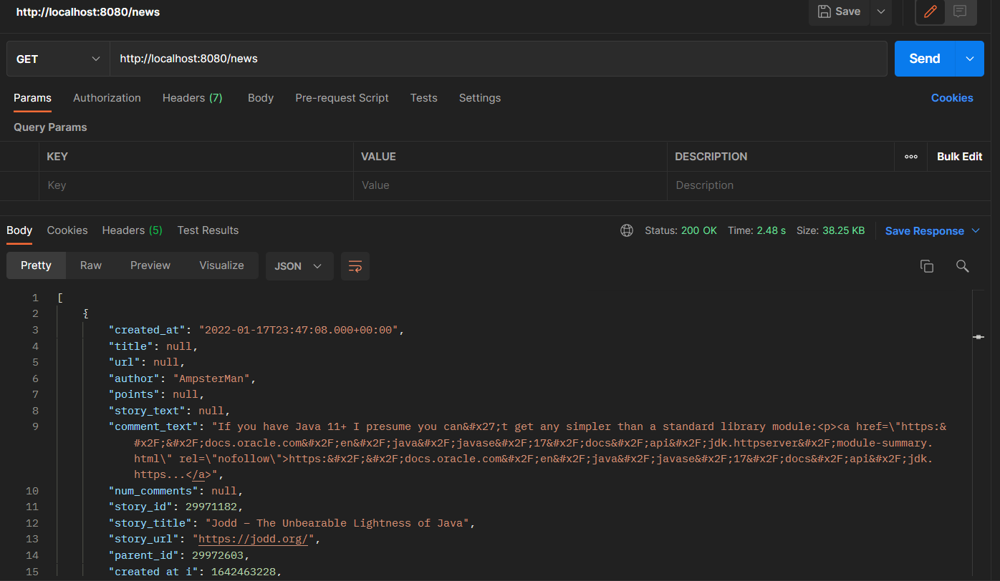

# API News
Desarrollado con Spring boot con maven. Toma el listado desde la API de HN tomando como referencia el siguiente enlace https://hn.algolia.com/api/v1/search_by_date?query=java 

## _HERRAMIENTAS NECESARIAS_
- Java 11.
- Postman.

## Pasos para levantar el proyecto
- Clonar el repositorio.
- Abrir en un Entorno de desarrollo como Intellij, Eclipse, Netbeans.
- Importar las dependencias de maven.
- Ejecutar el servidor de spring.

Una vez levantado el proyecto la ruta será http://localhost:8080/.
Puede utilizar herramientas como postman para probar los servicios.
Ej: realizando una petición get al http:http://localhost:8080/news para verificar el listado de respuestas

